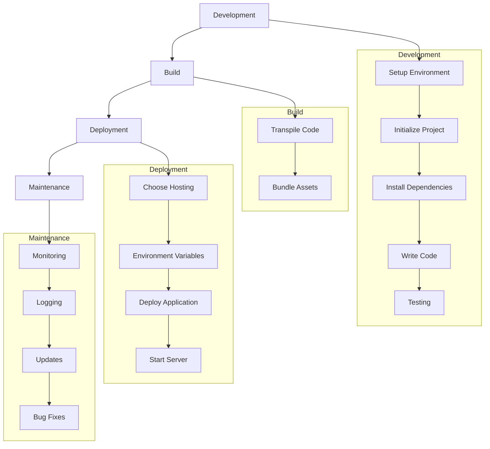

# Node.js Application Lifecycle

## Introduction
This document outlines the typical lifecycle of a Node.js application, from development to deployment and maintenance.

## Development
1. **Setup Environment**: Install Node.js and npm.
2. **Initialize Project**: Create a new project directory and run `npm init` to generate `package.json`.
3. **Install Dependencies**: Use `npm install` to add necessary packages.
4. **Write Code**: Develop your application using JavaScript or TypeScript.
5. **Testing**: Write and run tests using frameworks like Mocha, Jest, or Jasmine.

## Build
1. **Transpile Code**: If using TypeScript or ES6+, transpile your code using Babel or TypeScript compiler.
2. **Bundle Assets**: Use tools like Webpack to bundle your application assets.

## Deployment
1. **Choose Hosting**: Select a hosting provider (e.g., AWS, Heroku, DigitalOcean).
2. **Environment Variables**: Set up environment variables for configuration.
3. **Deploy Application**: Upload your application to the hosting provider.
4. **Start Server**: Use process managers like PM2 or Docker to manage your Node.js processes.

## Maintenance
1. **Monitoring**: Implement monitoring using tools like New Relic or Datadog.
2. **Logging**: Set up logging with tools like Winston or Bunyan.
3. **Updates**: Regularly update dependencies and Node.js version.
4. **Bug Fixes**: Address bugs and issues reported by users.

## Conclusion
Following this lifecycle ensures a structured approach to developing, deploying, and maintaining a Node.js application.
## Diagram

Below is a visual representation of the Node.js application lifecycle:

